<div align="center">

# 🦀 a2a-rs

**The Rust SDK for the [Agent-to-Agent (A2A) Protocol](https://a2a-protocol.org/) v0.3**

[](https://crates.io/crates/a2a-rs)
[](https://docs.rs/a2a-rs)
[](LICENSE)
[](#test-suite)

*Type-safe, async-first, zero-copy — built on tokio + axum + serde.*

[Getting Started](#installation) · [Client Guide](#-client) · [Server Guide](#-server) · [Examples](examples/) · [API Docs](https://docs.rs/a2a-rs)

</div>

---

## What is A2A?

A2A is an open protocol that lets AI agents talk to each other over **JSON-RPC 2.0**. Agents can delegate tasks, stream real-time updates via **Server-Sent Events (SSE)**, and collaborate across language boundaries.

This crate gives you everything you need to build A2A agents and clients in Rust — with full compile-time type safety and async I/O.

## Architecture


## Task Lifecycle


## Request Flow


## Installation

```toml
[dependencies]
a2a-rs = "0.1"
```

### Feature Flags

| Feature | Default | Description |
|---------|:-------:|-------------|
| `client` | ✅ | HTTP client with SSE streaming (reqwest) |
| `server` | ✅ | Server framework with axum integration |
| `full` | ❌ | Enable everything |

```toml
# Client only
a2a-rs = { version = "0.1", default-features = false, features = ["client"] }

# Server only
a2a-rs = { version = "0.1", default-features = false, features = ["server"] }
```

---

## 🔌 Client

### Send a Message

```rust
use a2a_rs::client::A2AClient;

#[tokio::main]
async fn main() -> Result<(), Box<dyn std::error::Error>> {
    let client = A2AClient::from_url("http://localhost:7420").await?;

    let task = client.send_text("Write a haiku about Rust").await?;
    println!("Task: {} — {:?}", task.id, task.status.state);

    Ok(())
}
```

### Stream Responses

```rust
let mut stream = client.send_text_stream("Tell me a story").await?;

while let Some(event) = stream.next().await {
    match event? {
        StreamResponse::StatusUpdate(u) => println!("Status: {:?}", u.status.state),
        StreamResponse::ArtifactUpdate(a) => println!("Artifact: {:?}", a.artifact.name),
        _ => {}
    }
}
```

### Multi-Turn Conversations

```rust
let context_id = Uuid::new_v4().to_string();

// First message
let task1 = client.send_text_in_context("My name is Alice", &context_id).await?;

// Follow-up in the same context
let task2 = client.send_text_in_context("What's my name?", &context_id).await?;
```

### Task Management

```rust
// Get a task
let task = client.get_task("task-123", None).await?;

// List tasks with filtering
let tasks = client.list_tasks(ListTasksParams {
    context_id: Some("ctx-456".into()),
    status: Some(vec![TaskState::Completed]),
    page_size: Some(10),
    page_token: None,
}).await?;

// Cancel a task
client.cancel_task("task-789").await?;

// Subscribe to live updates
let mut updates = client.subscribe("task-123").await?;
while let Some(event) = updates.next().await {
    println!("{:?}", event?);
}
```

---

## ⚡ Server

### Implement Your Agent

```rust
use a2a_rs::server::{AgentExecutor, RequestContext, EventQueue, TaskUpdater};
use a2a_rs::types::Part;
use async_trait::async_trait;

struct EchoAgent;

#[async_trait]
impl AgentExecutor for EchoAgent {
    async fn execute(
        &self,
        context: RequestContext,
        event_queue: EventQueue,
    ) -> a2a_rs::error::A2AResult<()> {
        let updater = TaskUpdater::new(
            event_queue,
            context.task_id.clone(),
            context.context_id.clone(),
        );

        let text = context.message.parts.iter()
            .find_map(|p| match p {
                Part::Text { text, .. } => Some(text.clone()),
                _ => None,
            })
            .unwrap_or_else(|| "…".to_string());

        updater.complete(Some(&format!("Echo: {text}"))).await?;
        Ok(())
    }

    async fn cancel(
        &self,
        context: RequestContext,
        event_queue: EventQueue,
    ) -> a2a_rs::error::A2AResult<()> {
        let updater = TaskUpdater::new(event_queue, context.task_id, context.context_id);
        updater.cancel(None).await?;
        Ok(())
    }
}
```

### Launch the Server

```rust
use a2a_rs::server::{a2a_router, DefaultRequestHandler, InMemoryTaskStore};
use a2a_rs::builders::AgentCardBuilder;
use std::sync::Arc;

#[tokio::main]
async fn main() -> Result<(), Box<dyn std::error::Error>> {
    let card = AgentCardBuilder::new("Echo Agent")
        .description("Echoes messages back")
        .version("1.0.0")
        .url("http://localhost:3000/a2a")
        .skill("echo", "Echo", "Echoes your message", &["demo"])
        .build();

    let handler = Arc::new(DefaultRequestHandler::new(
        Arc::new(EchoAgent),
        Arc::new(InMemoryTaskStore::new()),
    ));

    let app = a2a_router(handler, card);
    let listener = tokio::net::TcpListener::bind("0.0.0.0:3000").await?;
    println!("Agent live at http://localhost:3000");
    axum::serve(listener, app).await?;

    Ok(())
}
```

**Endpoints served automatically:**

| Route | Method | Description |
|-------|--------|-------------|
| `/a2a` | `POST` | JSON-RPC 2.0 endpoint |
| `/.well-known/agent.json` | `GET` | Agent card discovery |

---

## Module Map

```mermaid
%%{init: {'theme': 'dark', 'themeVariables': {'primaryColor': '#bb86fc', 'primaryTextColor': '#fff', 'primaryBorderColor': '#bb86fc', 'lineColor': '#03dac6', 'secondaryColor': '#121212', 'tertiaryColor': '#1e1e1e', 'clusterBkg': '#1e1e1e', 'clusterBorder': '#333'}}}%%
graph LR
    subgraph crate["a2a_rs"]
        types["types\n─────\nAgentCard\nTask\nMessage\nPart\nArtifact\nStreamResponse"]
        builders["builders\n─────\nAgentCardBuilder\nClientBuilder\nServerBuilder"]
        error["error\n─────\nA2AError\nA2AResult"]

        subgraph client_mod["client"]
            client["A2AClient"]
            card["CardResolver"]
            transport["JsonRpcTransport"]
            sse["SseStream"]
        end

        subgraph server_mod["server"]
            executor["AgentExecutor trait"]
            handler["RequestHandler trait"]
            store["TaskStore trait"]
            updater["TaskUpdater"]
            queue["EventQueue"]
            axum_int["axum integration"]
        end

        subgraph utils_mod["utils"]
            u_task["task"]
            u_msg["message"]
            u_parts["parts"]
            u_artifact["artifact"]
            u_ext["extensions"]
        end
    end

    types --> client_mod
    types --> server_mod
    types --> utils_mod
    builders --> types
    error --> client_mod
    error --> server_mod

    style crate fill:#0d1117,stroke:#30363d,stroke-width:2px,color:#fff
    style client_mod fill:#1a1a2e,stroke:#bb86fc,stroke-width:2px,color:#fff
    style server_mod fill:#1a1a2e,stroke:#03dac6,stroke-width:2px,color:#fff
    style utils_mod fill:#1a1a2e,stroke:#cf6679,stroke-width:2px,color:#fff
```



---

## SDK Comparison

> How `a2a-rs` maps to the official Python and JavaScript SDKs.

| Component | Python (`a2a-python`) | JavaScript (`@a2a-js/sdk`) | **Rust (`a2a-rs`)** |
|-----------|----------------------|---------------------------|---------------------|
| Client | `Client` / `BaseClient` | `A2AClient` | `A2AClient` |
| Agent logic | `AgentExecutor(ABC)` | `AgentExecutor` interface | `AgentExecutor` trait |
| Task store | `TaskStore(ABC)` | `TaskStore` | `TaskStore` trait |
| Request handler | `RequestHandler` | `RequestHandler` | `RequestHandler` trait |
| HTTP framework | Flask / FastAPI | Express / Hono | **axum** |
| Streaming | SSE via httpx | SSE via fetch | SSE via **reqwest** |
| Serialization | pydantic | zod | **serde** |

### Why Rust?

- **Compile-time type safety** — catch protocol errors before runtime
- **Zero-copy deserialization** — serde parses JSON without unnecessary allocations
- **Async-native** — built on tokio for high-throughput concurrent I/O
- **Trait-based extensibility** — swap in custom `TaskStore`, `RequestHandler`, or transport
- **Single binary deployment** — no runtime dependencies

---

## Test Suite

**765 tests — all passing.**

```
cargo test

running 765 tests ...
test result: ok. 765 passed; 0 failed; 0 ignored
```

Coverage includes:

| Category | Tests | What's Covered |
|----------|------:|---------------|
| Serialization | 122 | All types round-trip through JSON correctly |
| Golden fixtures | 65 | JSON output matches reference fixtures |
| Cross-language compliance | 55 | Parity with Python SDK serialization |
| Client | 48 | Transport, card resolution, auth, errors, task management |
| Server | 62 | Request handling, task store, executor, event queue, updater |
| Integration | 32 | Client ↔ Server end-to-end, streaming |
| Utils | 80+ | Message/artifact/part helpers, task lifecycle |
| Protocol compliance | 35 | Kind fields, error codes, A2A spec conformance |
| Doc-tests | 26 | Every public API example compiles and runs |

---

## Protocol Compliance

Implements **A2A v0.3** per the [official specification](https://a2a-protocol.org/latest/specification/).

All types match the [protobuf definitions](https://github.com/a2aproject/A2A/blob/main/specification/a2a.proto).

### JSON-RPC Methods

| Method | Description | Streaming |
|--------|-------------|:---------:|
| `message/send` | Send a message, get a task back | ❌ |
| `message/stream` | Send a message, stream updates | ✅ SSE |
| `tasks/get` | Retrieve task by ID | ❌ |
| `tasks/list` | List/filter tasks | ❌ |
| `tasks/cancel` | Cancel a running task | ❌ |
| `tasks/subscribe` | Subscribe to task updates | ✅ SSE |

### Error Codes

| Code | Name |
|------|------|
| `-32001` | TaskNotFoundError |
| `-32002` | TaskNotCancelableError |
| `-32003` | PushNotificationNotSupportedError |
| `-32004` | UnsupportedOperationError |
| `-32005` | ContentTypeNotSupportedError |
| `-32600` to `-32700` | Standard JSON-RPC errors |

---

## Examples

```bash
# Run the echo agent server
cargo run --example echo_agent

# Send a message from a client
cargo run --example hello_client

# Stream responses
cargo run --example streaming_client

# Multi-turn conversation
cargo run --example multi_turn
```

---

## Contributing

Contributions welcome! Please ensure all code matches the [A2A v0.3 spec](https://a2a-protocol.org/latest/specification/).

When adding types, verify against:
- [Official protobuf spec](https://github.com/a2aproject/A2A/blob/main/specification/a2a.proto)
- [Python SDK](https://github.com/a2aproject/a2a-python) for reference behavior
- [JavaScript SDK](https://github.com/a2aproject/a2a-js) for JSON serialization patterns

## License

[MIT](LICENSE)

---

<div align="center">

**[A2A Protocol](https://a2a-protocol.org/)** · **[Specification](https://a2a-protocol.org/latest/specification/)** · **[GitHub](https://github.com/a2aproject/A2A)** · **[Python SDK](https://github.com/a2aproject/a2a-python)** · **[JavaScript SDK](https://github.com/a2aproject/a2a-js)**

</div>
